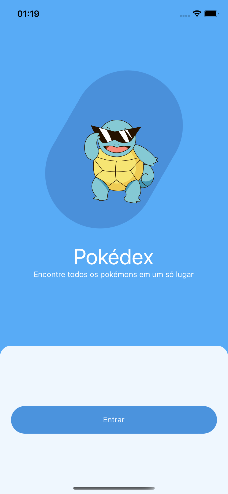
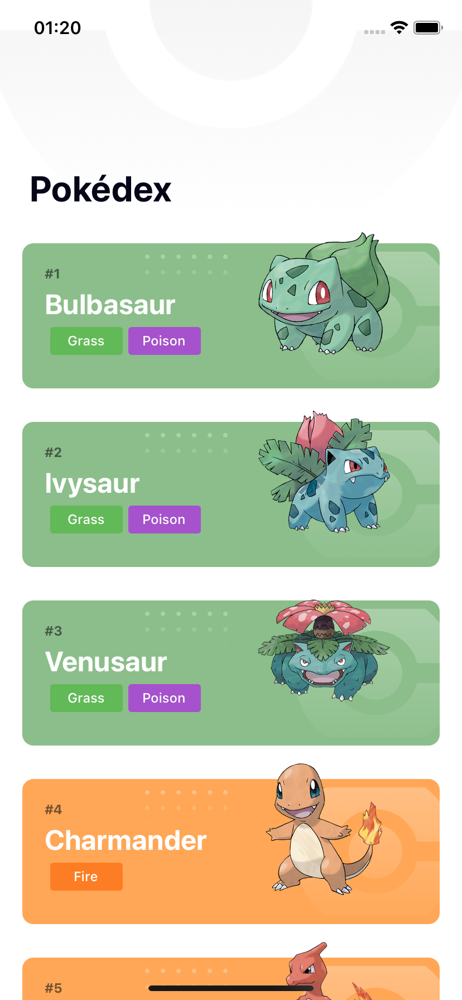
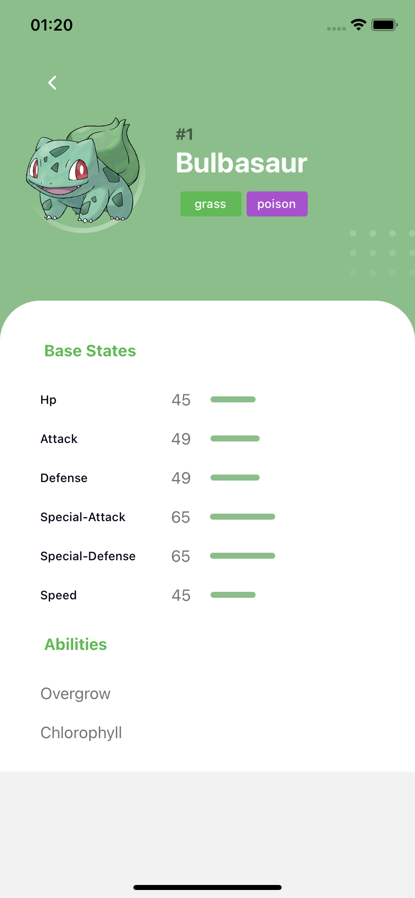

<h1 align="center">
  
</h1>

## <b>Sobre o projeto</b>

Comecei a realizar esse projeto, para estudar mais sobre chamadas de API e encontrei a [pokeapi](https://pokeapi.co).

Esse Projeto lista os pokemons da API.

Layout desse projeto no [figma](https://www.figma.com/file/THLxZSlOoUYMZrjFg0Kl1M/Pokédex?node-id=18241%3A2789)

---

## <b>Funcionalidades</b>

- Listagem de pokemons da api
- Visualizar detalhes do pokemon
- Listar Habilidades, hp, attack...

---

## <b>Tecnologias utilizadas</b>

O projeto foi feito utilizando as seguintes tecnologias:

- Expo;
- React Native;
- Styled-Components;
- Typescript;
- Axios;
- Reanimated V2;

---

## <b>Prints</b> 

<h1 align="center">
    
    
    
    
</h1>

---

### <b>🚧 👩🏻‍💻 Projeto em construção ainda... 👩🏻‍💻 🚧</b>
